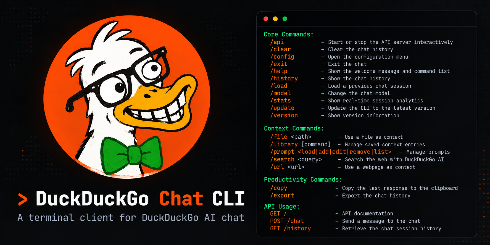
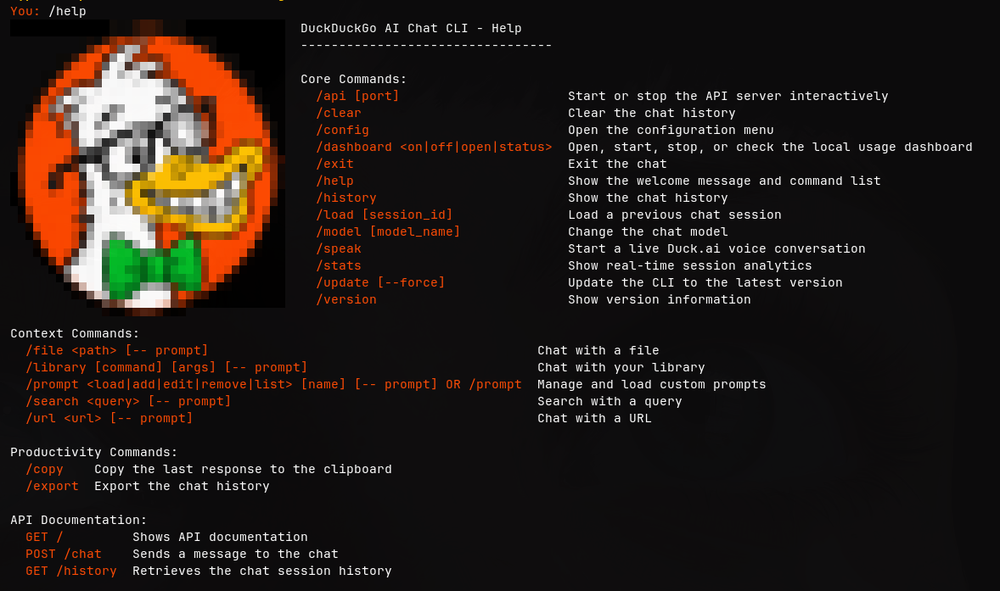
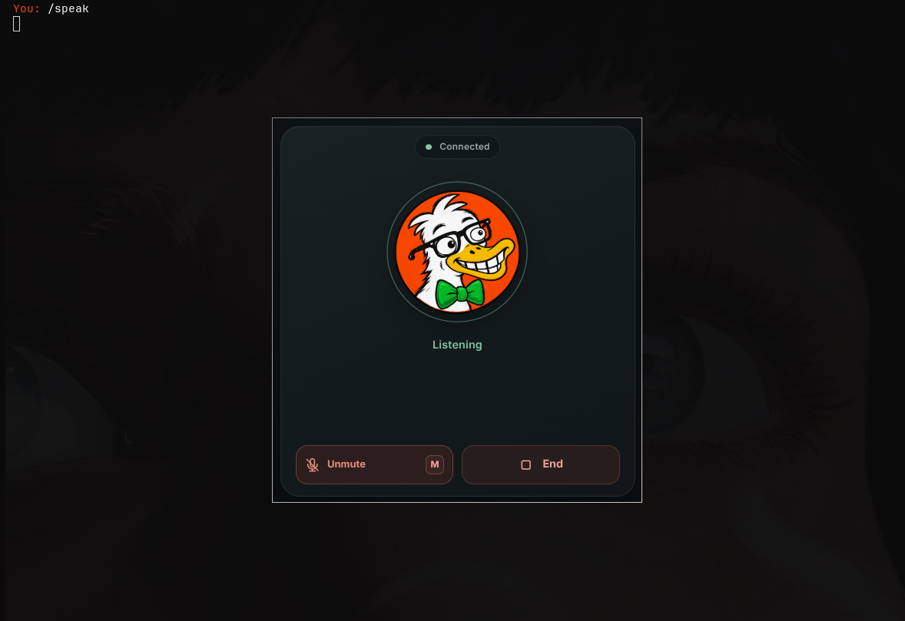
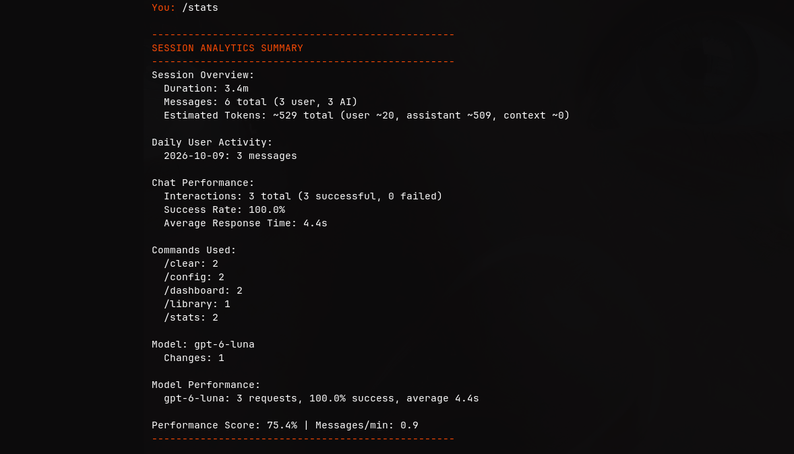
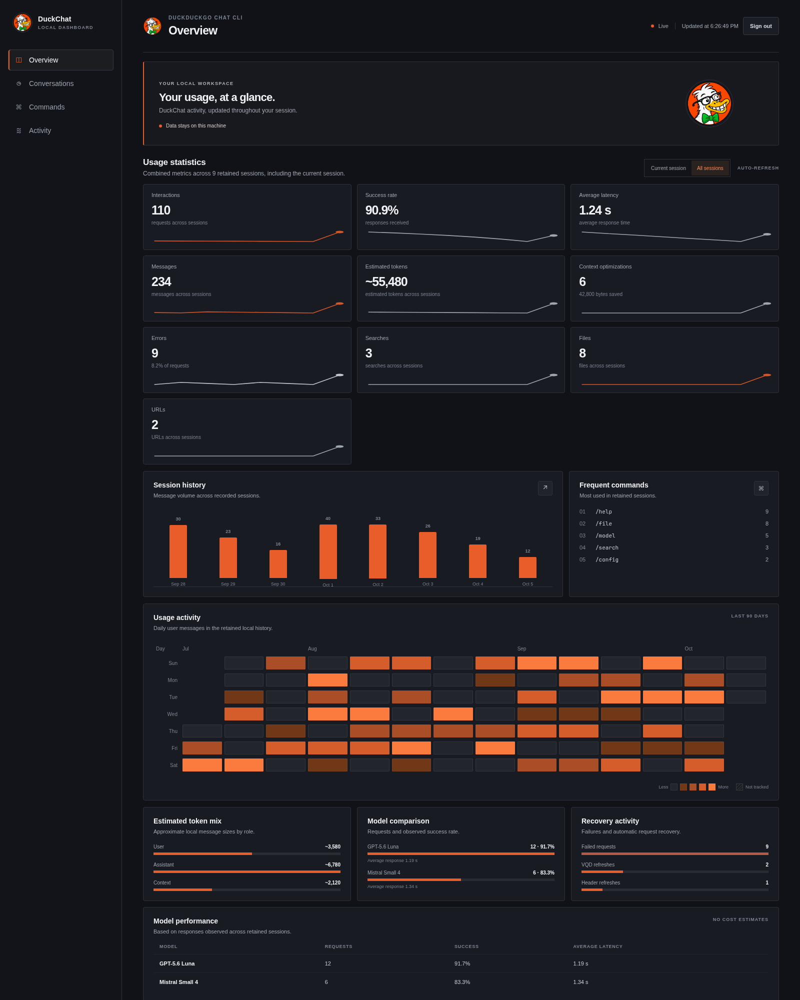
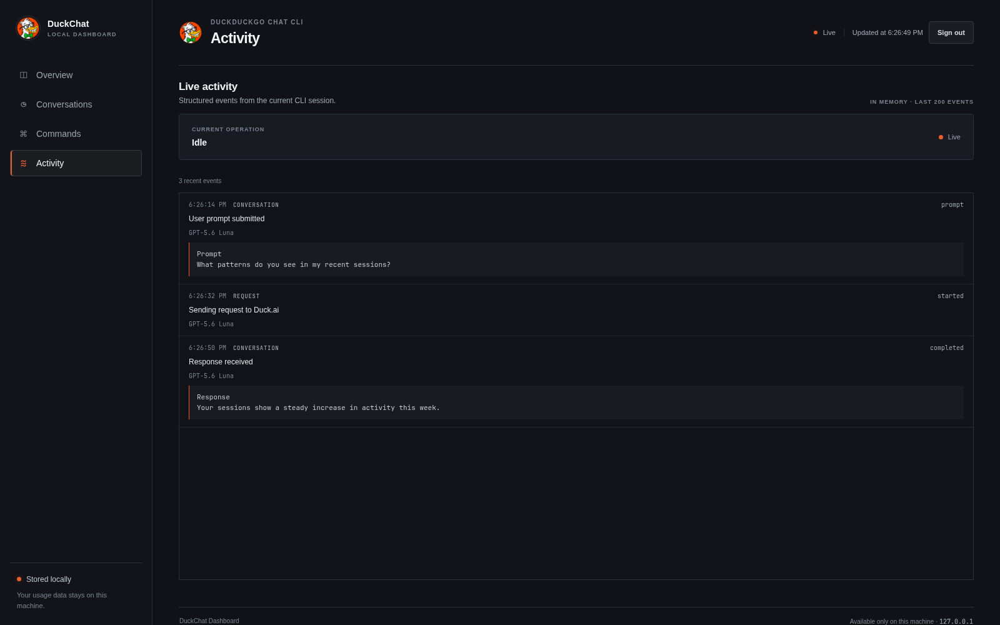
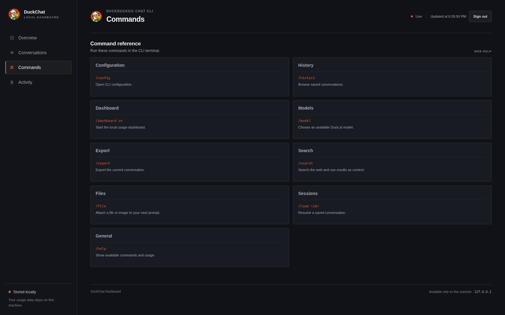

# DuckDuckGo AI Chat CLI

<div align="center">
  
  <br>
  <strong>A terminal client for Duck.ai</strong><br>
  <em>Switch models, add context from files, URLs and web search, and keep a local conversation history.</em>
</div>

<p align="center">
  
  <a href="https://github.com/benoitpetit/duckduckgo-chat-cli/releases" target="_blank">
    
  </a>
  <a href="https://github.com/benoitpetit/duckduckgo-chat-cli?tab=readme-ov-file#installation" target="_blank">
    
  </a>
  
  <a href="https://liberapay.com/devbyben" target="_blank">
    
  </a>
</p>

<p align="center">
  <a href="#key-features">Features</a> •
  <a href="#available-models">Models</a> •
  <a href="#installation">Install</a> •
  <a href="#usage">Usage</a> •
  <a href="#configuration">Configuration</a> •
  <a href="#local-usage-dashboard">Dashboard</a> •
  <a href="#troubleshooting">Troubleshooting</a>
</p>

## Key features

- Stream responses in the terminal, switch between available models, and cancel an active request with Ctrl-C.
- Add local text or image files, URLs, and web search results to a conversation. Chain `/file`, `/url`, and `/search` with `&&` before a prompt.
- Review session statistics with `/stats`, search and restore local conversation history, and export or copy responses.
- The CLI optimizes long conversations automatically and keeps searchable local session archives.
- The local dashboard shows usage charts, live activity, session history, and CLI command documentation. Conversation visibility and AI reports are configurable.
- Organize local text files into libraries, then search them or load selected content into a conversation.
- Run the optional HTTP API on `127.0.0.1` for local integrations. An API key is required before binding beyond the local machine.
- Use command menus, autocompletion, saved prompts, and formatted output on Linux, Windows, and macOS.
- Enable Duck.ai's native web search for citations or use image generation.

## Screenshots

### Terminal

| Interactive help | Voice conversation | Session statistics |
|:--|:--|:--|
| <a href="docs/images/cli-help.png"></a> | <a href="docs/images/voice-session.png"></a> | <a href="docs/images/session-stats.png"></a> |
| The `/help` command list<br>in the interactive CLI. | The `/speak` command opens<br>a live voice session with<br>controls and a transcript. | Session duration, token counts,<br>success rate, commands,<br>and model performance. |

### Local Dashboard

The dashboard runs locally and shows your own usage data. These screenshots use representative sample metrics.

| Overview | Live activity | Command reference |
|:--|:--|:--|
| <a href="docs/images/dashboard-overview.png"></a> | <a href="docs/images/dashboard-activity.png"></a> | <a href="docs/images/dashboard-commands.png"></a> |
| Session statistics,<br>usage activity, and<br>model charts. | Recent prompts and<br>responses as they happen. | The dashboard's reference<br>for CLI commands. |

## Installation

> [Download Latest Release](https://github.com/benoitpetit/duckduckgo-chat-cli/releases/latest)

### Download and run a release binary

<details>
<summary><strong> Windows (PowerShell)</strong></summary>

```powershell
$exe="duckduckgo-chat-cli_windows_amd64.exe"; Invoke-WebRequest -Uri ((Invoke-RestMethod "https://api.github.com/repos/benoitpetit/duckduckgo-chat-cli/releases/latest").assets | Where-Object name -like "*windows_amd64.exe").browser_download_url -OutFile $exe; Start-Process -Wait -NoNewWindow -FilePath ".\$exe"
```

</details>

<details>
<summary><strong> Linux (curl)</strong></summary>

```bash
asset_url=$(curl -fsSL https://api.github.com/repos/benoitpetit/duckduckgo-chat-cli/releases/latest | sed -n 's/.*"browser_download_url": "\([^"]*_linux_amd64\)".*/\1/p' | head -n 1)
curl -fL "$asset_url" -o duckchat
chmod +x duckchat
./duckchat
```

</details>

<details>
<summary><strong> macOS (curl)</strong></summary>

<br/>
<strong>Apple Silicon (ARM64):</strong>

```bash
asset_url=$(curl -fsSL https://api.github.com/repos/benoitpetit/duckduckgo-chat-cli/releases/latest | sed -n 's/.*"browser_download_url": "\([^"]*_darwin_arm64\)".*/\1/p' | head -n 1)
curl -fL "$asset_url" -o duckchat
chmod +x duckchat
./duckchat
```

<strong>Intel (AMD64):</strong>

```bash
asset_url=$(curl -fsSL https://api.github.com/repos/benoitpetit/duckduckgo-chat-cli/releases/latest | sed -n 's/.*"browser_download_url": "\([^"]*_darwin_amd64\)".*/\1/p' | head -n 1)
curl -fL "$asset_url" -o duckchat
chmod +x duckchat
./duckchat
```

</details>

### Build from source

**Prerequisites:**

- Go 1.26+ (`go version`)
- Chrome or Chromium for chat and voice; version 115+ is recommended (`chromium-browser --version`)

The chat backend is Duck.ai. Chat and voice use Chrome or Chromium. The interactive startup check warns when the version is below 115.0.5790.110 and continues. The CLI does not require account credentials.

```sh
git clone https://github.com/benoitpetit/duckduckgo-chat-cli
cd duckduckgo-chat-cli
./scripts/build.sh
```

## Usage

### Command-line options

Use `--help` or `--version` without starting the interactive chat. To send one
prompt and exit, pass `--prompt`; `--model` optionally selects a model for that
request. Add `--json` for a quiet, machine-readable JSON result. Use `--prompt -`
to read the prompt from standard input:

```sh
./duckchat --help
./duckchat --prompt "Summarize the Go memory model" --model gpt-6-luna
./duckchat --prompt "Summarize the Go memory model" --json
printf 'Summarize this input' | ./duckchat --prompt -
```

JSON mode writes one object to stdout, for example
`{"response":"...","model":"gpt-6-luna"}`. Errors use `{"error":"..."}`.
Progress messages and the spinner are suppressed in this mode.

The CLI must have accepted the terms of service in an interactive session
before one-shot prompts can run without a terminal. One-shot mode does not
start the REPL, API, dashboard, or startup update check. The answer is written
to stdout; status messages and errors are written to stderr. With `--json`,
stdout contains only the JSON result or error object, and progress output is
suppressed. Completed one-shot exchanges are saved in local conversation
history.

Start the interactive chat by running the binary without options. At the `You:` prompt, type `/help` to see the available chat commands. The separate `duckchat --help` option lists command-line flags.

### Typical workflow

<details>
<summary><strong> Example 1: Command Chaining</strong></summary>

```bash
# Chain multiple commands to build a rich context before asking a question
You: /url https://devbyben.fr/about && /search devbyben.fr twitter account && /file ~/Documents/my_notes.md -- Based on all this, write a summary.
```

</details>

<details>
<summary><strong> Example 2: Code Analysis</strong></summary>

```bash
./duckchat
Accept terms? [yes/no] yes
Type /help to show available commands

You: /search Go concurrency patterns -- What are the best practices?
 Searching for: Go concurrency patterns
 Added 10 search results to the context
Processing your request about the search results...

You: /file main.go -- Explain this code and suggest improvements
 Adding file content: main.go
 Successfully added content from file: main.go
Processing your request about the file...

GPT-6 Luna: Based on the search results about Go concurrency patterns and your code...
[Detailed analysis follows]

You: /stats
 SESSION ANALYTICS SUMMARY
═══════════════════════════════════════════════════════════
 Session Performance
   Duration: 8.5m | Messages: 6 | Avg Response: 1.1s
   Chat Success Rate: 100% (3/3 requests)
═══════════════════════════════════════════════════════════

You: /copy
Choose what to copy:
1) Last Q&A exchange
2) Largest code block
3) Cancel
Enter your choice: 2
 Content copied to clipboard
```

</details>

<details>
<summary><strong> Example 3: Session Loading</strong></summary>

```bash
# List and interactively select a previous session to restore
You: /load

# Or load a session directly by its ID
You: /load session_12345

# The chat context and history will be restored for continued conversation.
```

</details>

### Command reference

| Command                                       | Example                                                    | Description                                                                                           |
| --------------------------------------------- | ---------------------------------------------------------- | ----------------------------------------------------------------------------------------------------- |
| `/search <query> [-- prompt]`                 | `/search machine learning -- What are the best practices?` | Add search results as context and optionally process them with a prompt                               |
| `/file <path> [-- prompt]`                    | `/file src/main.go -- Explain this code`                   | Import text or attach an image to the next prompt, or analyze it immediately                          |
| `/library [command] [args] [-- prompt]`       | `/library load docs -- Summarize these files`               | Manage libraries, search them, or load one for an immediate prompt                                     |
| `/url <link> [-- prompt]`                     | `/url github.com/golang -- Summarize this page`            | Add webpage content as context and optionally process it with a prompt                                |
| `/prompt` or `/prompt add <name> -- <prompt>` | `/prompt` or `/prompt add myprompt -- This is my prompt`   | Manage and load custom prompts. `/prompt` opens the interactive menu; subcommands are also available. |
| `/speak`                                      | `/speak`                                                   | Open a compact Chrome/Chromium window for a live Duck.ai voice conversation                          |
| `/stats`                                      | `/stats`                                                   | Show current CLI session analytics and performance metrics                                            |
| `/dashboard <action>`                         | `/dashboard on`                                            | Start or stop the local usage dashboard, open its app window, or show its status (`on`, `off`, `open`, `status`) |
| `/api [port]`                                 | `/api` or `/api 8080`                                      | Start or stop the API server                                                                          |
| `/model`                                      | `/model` or `/model 2`                                     | Change AI model (interactive)                                                                         |
| `/clear`                                      | `/clear`                                                   | Reset conversation context (with session save)                                                        |
| `/export`                                     | `/export`                                                  | Export content (interactive)                                                                          |
| `/copy`                                       | `/copy`                                                    | Copy to clipboard (interactive)                                                                       |
| `/history`                                    | `/history`                                                 | Display conversation history                                                                          |
| `/load [session_id]`                          | `/load` or `/load session_12345`                           | Load and restore a previous session interactively or by ID                                            |
| `/config`                                     | `/config`                                                  | Modify configuration settings                                                                         |
| `/version`                                    | `/version`                                                 | Show version and system info                                                                          |
| `/update`                                     | `/update` or `/update --force`                             | Update the CLI to the latest version                                                                  |
| `/help`                                       | `/help`                                                    | Show the welcome message and interactive command list                                                 |
| `/exit`                                       | `/exit`                                                    | Exit application (with analytics)                                                                     |

Use `&&` to combine `/file`, `/url`, and `/search` context commands before a
prompt. `/library` is a standalone command; `/library load <library> -- <prompt>`
can submit a prompt about the loaded files, but `/library` cannot be included
in an `&&` chain. `/speak` is a standalone command and cannot be chained.

### Prompt management

- `/prompt` : Open the interactive prompt management menu (list, add, edit, remove)
- `/prompt list` : List all saved prompts
- `/prompt add <name> -- <prompt>` : Add a new prompt
- `/prompt edit <name> -- <prompt>` : Edit an existing prompt
- `/prompt remove <name>` : Remove a prompt
- `/prompt load <name>` : Send the prompt content as a message to the model

> **Note:** `/prompt` is not chainable and does not support chaining with `&&`. The `--` is only for separating the prompt text, not for chaining.

## Available models

| Model Name           | Integration ID       | Alias            | Strength             | Best For                 | Characteristics                     |
| :------------------- | :------------------- | :--------------- | :------------------- | :----------------------- | :---------------------------------- |
| **GPT-6 Luna**       | gpt-6-luna           | gpt-6-luna       | General purpose      | Everyday questions       | • Fast<br>• Well-balanced           |
| GPT-5.6 Luna         | gpt-5.6-luna         | gpt-5.6-luna     | Previous model       | Existing configurations  | • Kept for compatibility            |
| **GPT-5.4 Nano**     | gpt-5.4-nano         | gpt-5.4-nano     | Lightweight tasks    | Quick answers            | • Fast<br>• Efficient               |
| **GPT-5.4 Mini**     | gpt-5.4-mini         | gpt-5.4-mini     | Speed                | Quick answers            | • Very fast<br>• Compact responses  |
| **Claude Haiku 4.5** | claude-haiku-4-5     | claude-haiku-4-5 | Creative writing     | Explanations & summaries | • Clear responses<br>• Concise      |
| **Mistral Small 4**  | mistral-small-2603   | mistral-small-4  | Knowledge & analysis | Complex topics           | • Reasoning<br>• Logic-focused      |
| **GPT OSS 120B**     | tinfoil/gpt-oss-120b | gpt-oss-120b     | Programming          | Code-related tasks       | • Technical precision<br>• Detailed |
| **Gemma 4 31B**      | tinfoil/gemma4-31b   | gemma-4-31b      | Lightweight tasks    | Short answers            | • Efficient<br>• Compact responses  |

Model strengths and suggested uses are guidance. The CLI source defines model IDs, aliases, the default model, and image-input compatibility.

## Configuration

The tables show configuration field names; the saved JSON keys use snake_case.

### Application settings

| Option         | Description                                                      | Default              | Range              |
| -------------- | ---------------------------------------------------------------- | -------------------- | ------------------ |
| `DefaultModel` | Starting AI model                                                | gpt-6-luna           | 8 models available |
| `GlobalPrompt` | Instructions prepended to the first message of each conversation | ""                   | Any text           |
| `ExportDir`    | Export directory                                                 | ~/Documents/duckchat | Any valid path     |
| `ShowMenu`     | Display commands on start                                        | false                 | true/false         |

### Search settings

| Option           | Description               | Default | Range      |
| ---------------- | ------------------------- | ------- | ---------- |
| `MaxResults`     | Results per search        | 10      | 1-50       |
| `MaxRetries`     | Retry attempts for search | 3       | 1-10       |
| `RetryDelay`     | Initial retry delay (s)   | 1       | 1-30       |
| `IncludeSnippet` | Show result descriptions  | true    | true/false |

### Library settings

| Option        | Description           | Default | Range          |
| ------------- | --------------------- | ------- | -------------- |
| `Enabled`     | Enable library system | true    | true/false     |
| `Directories` | List of library paths | []      | Array of paths |

### Native Duck.ai tools

Native Web Search and image generation are available as opt-in features. Open `/config`, choose
`Duck.ai Native Tools`, and enable the capabilities you want. Web citations are
added to the streamed response. Generated images are decoded from the Duck.ai
response and saved under `<ExportDir>/images`.

These features require Chrome or Chromium.

`/search` makes an explicit DuckDuckGo web search and adds its results to the conversation context.
Native Web Search is separate. When enabled, Duck.ai can decide whether a prompt needs live web results.

| Option                  | Description                 | Default |
| ----------------------- | --------------------------- | ------- |
| `Tools.Enabled`         | Enable native Duck.ai tools | false   |
| `Tools.WebSearch`       | Allow native Web Search     | false   |
| `Tools.ImageGeneration` | Allow image generation      | false   |

### Rate limit fallback

Chat requests use Chrome or Chromium in the background and do not open a
separate browser window.

When Duck.ai answers with HTTP 429, the interactive CLI treats the browser as a
last resort and opens `https://duck.ai/` in your default browser so you can
continue the conversation there. The rate-limit error is still reported, and the
CLI stays usable.

A cooldown stops a burst of consecutive rate-limited messages from opening one
tab per message: after the first launch, further 429s only print a reminder
until the cooldown expires. Turn the fallback off in `/config`, or set
`rate_limit.open_browser` to `false` in `config.json`.

| Option                      | Default | Description                                                              |
| --------------------------- | ------- | ------------------------------------------------------------------------ |
| `RateLimit.OpenBrowser`     | `true`  | Open duck.ai in the default browser as a last resort on HTTP 429         |
| `RateLimit.CooldownMinutes` | `10`    | Minimum delay between two automatic browser launches (1 or more)         |

### File and image support

`/file` imports local text files and can attach PNG, JPEG, or WebP images to a
prompt. Image files must be at most 10 MiB and have a matching extension and
file signature. Use `/file path/to/image.png` to attach an image to your next
prompt, or `/file path/to/image.png -- Describe this image` to send it with an
immediate prompt. Images wider or taller than 512 pixels are resized when they
can be decoded safely; WebP images that need resizing are converted to JPEG
or PNG, and resized JPEGs keep EXIF metadata. For images that do not need
resizing, JPEGs without EXIF can be re-encoded at quality 82, and PNGs can be
recompressed losslessly. The CLI uses a compressed result only when it is
smaller than the original. WebP files and JPEGs with EXIF that do not need
resizing are sent unchanged. Resized images are encoded to fit Duck.ai's limit,
even if the output file is larger. The source file is never modified; images
too large to decode safely are also left unchanged.
Images are stored in local conversation archives so resumed sessions retain
their context. `/library` continues to load text and source files only. Duck.ai
does not accept image uploads for every model. If the selected model cannot
process images, the CLI routes that image conversation through GPT-5.4 Mini and
tells you when it does so. Native image generation is supported separately as
described above.

### Voice conversation

Run `/speak` in the interactive CLI to open a compact Chrome/Chromium app window
(480 × 500 pixels by default, without the tab strip). Select **Start** and allow
microphone access when prompted. Use **Mute** to mute or unmute the microphone
and **End** to close the call. Adjust the window width and height in
`/config` → **Audio Agent Speak**.

The voice window shows live user and assistant transcripts. The CLI does not save
voice audio or transcripts in local conversation archives, and voice turns stay
separate from the terminal's text conversation history. `/speak` needs Chrome or
Chromium, but no GTK, WebKitGTK, GStreamer, or separate macOS companion package.

### API settings

| Option      | Description             | Default     | Range                        |
| ----------- | ----------------------- | ----------- | ---------------------------- |
| `Enabled`   | Enable API server       | `false`     | `true`/`false`               |
| `Host`      | Bind address            | `127.0.0.1` | Local address by default     |
| `Port`      | API server port         | `8080`      | Any valid port               |
| `Autostart` | Start API on app launch | `false`     | `true`/`false`               |
| `APIKey`    | Protect API requests    | empty       | Required for remote exposure |

For safety, the API refuses to bind to a non-loopback address unless an
`APIKey` is configured. Keep the default loopback binding when the API is only
needed locally.

> **Tip:** Use `/config` to modify these settings interactively.

## Local usage dashboard

The CLI can serve a private usage dashboard from the same process. It listens only on `127.0.0.1`. `/dashboard on`, `/dashboard off`, and `/dashboard status` control the running service; `/dashboard open` starts the service if needed and opens it in a Chrome/Chromium app window. Autostart and dashboard options are configured separately in `/config`.

```text
/dashboard on      Start the dashboard and print its local URL
/dashboard off     Stop the dashboard
/dashboard open    Open the dashboard in a Chrome/Chromium app window
/dashboard status  Show whether it is running
```

### Dashboard settings

Open `/config` and choose Dashboard Settings. Conversation history and AI analysis use separate opt-in settings.

| Option                      | Default | Description                                                                                                                                                     |
| --------------------------- | ------- | --------------------------------------------------------------------------------------------------------------------------------------------------------------- |
| `Autostart`                 | `false` | Start the loopback dashboard with the CLI                                                                                                                       |
| `Port`                      | `8765`  | Local dashboard port; the service binds only to `127.0.0.1`                                                                                                     |
| `RefreshIntervalSeconds`    | `3`     | Browser refresh period (1–60 seconds)                                                                                                                           |
| `RetentionDays`             | `90`    | Retention for usage snapshots and conversation archives (1–3650 days)                                                                                           |
| `ShowConversations`         | `false` | Show archived conversations in the dashboard                                                                                                                    |
| Dashboard password          | Not set | Set or remove it from this menu; when set, a browser sign-in is required                                                                                        |
| `ShowConversationContent`   | `false` | Show prompt and assistant response text in the live Activity page; common absolute paths and labelled secrets are masked, and disabling it clears retained text |
| `AllowConversationAnalysis` | `false` | Permit an explicitly submitted AI report to use sampled excerpts                                                                                                |
| `AnalysisTokenBudget`       | `8000`  | Approximate input-token ceiling for the conversation report                                                                                                     |

Usage snapshots and conversation archives are stored locally. Their shared retention defaults to 90 days (up to 100 conversation archives are kept). The conversation list is disabled by default. When it is enabled, the dashboard can search archives, display transcripts, and copy `/load <session_id>` to resume one in the terminal.

The overview shows a GitHub-style activity grid for the retained window (90 days by default, configurable from `/config`), approximate token totals split by user, assistant, and context, per-model request and success comparisons, and failed-request and automatic-refresh counts. Token values are estimates based on local text sizes, not provider billing totals. Context estimates include inserted file, URL, and search text, along with image labels; binary image payload sizes are not converted to tokens. Dates before local daily tracking began are marked as untracked.

The dashboard includes a web reference for CLI commands, session and per-model statistics, and optional AI reports. Metrics reports use aggregate statistics only. Conversation analysis is independent from transcript viewing: **Allow conversation analysis** can authorize an explicit report without turning on the conversation page. Before sending sampled excerpts to Duck.ai, the dashboard shows the included session count and estimated input tokens; the default configurable budget is 8,000 estimated tokens. The provider's actual token count can differ.

The **Activity** page streams structured CLI events in real time. It keeps at most
200 recent events in memory and does not write an activity log to disk. Prompt
and response text stay hidden unless **Show prompt and response content** is
enabled in `/config`; turning it off clears retained conversation text.

To require a password, open `/config` → **Dashboard Settings** → **Set/change dashboard password**. The password is stored as a salted verifier in the local configuration, and the browser session ends when the dashboard server stops. Choose **Remove dashboard password** to turn sign-in off.

## Auto-update system

The CLI checks GitHub releases for updates at startup. You can also run an
update manually.

### Update features

- Checks for new versions every 4 hours at startup.
- Verifies downloaded binaries with SHA256 checksums.
- Runs on Linux, Windows, and macOS.
- Replaces the current binary in place.
- Creates a backup and restores it if an update fails.

### Usage

```bash
# Check for updates and install (with confirmation)
/update

# Force update without confirmation
/update --force

# The CLI will also prompt you when updates are available:
 A new version is available!
   Current: <installed version>
   Latest:  <available version>
 Run '/update' to update to the latest version.
```

### Update process

1. Detect your operating system and architecture.
2. Download the matching binary from GitHub Releases.
3. Verify its SHA256 checksum.
4. Replace the current binary.
5. Prompt you to restart the CLI.

## Troubleshooting

### Connection issues

If you encounter connection errors:

```bash
# Start a fresh conversation
/clear

# Check your Chrome/Chromium installation
chromium-browser --version

# Enable debug mode
DEBUG=true ./duckchat

# View session analytics for debugging
/stats
```

If a request is taking too long, press Ctrl-C once to cancel that request and
continue using the CLI. Press Ctrl-C again when the prompt is idle to exit.

## Development & contributing

### Automated release process

The local build and verification scripts are also used by GitHub Actions:

- Build locally with `./scripts/build.sh 1.8.0`.
- Run `./scripts/pre-release-check.sh` before a release.
- To publish from GitHub, open **Actions → Build and Release → Run workflow** and enter a version such as `1.8.0`.
- After pushing a clean `master`, run `./scripts/release.sh 1.8.0` with an authenticated GitHub CLI.
- The Windows `.exe` includes `docs/images/logo.png` as its application icon. Linux and macOS command-line binaries have no application icon.

### Development documentation

- **[CI/CD workflow](.github/workflows/release.yml)** - Build and release automation
- **[Build and verification](docs/BUILD.md)** - Local build, Windows icon, and pre-release checks

## Project links

- [Support the project](https://devbyben.fr/don)
- [Voie: free model API](https://github.com/benoitpetit/voie)

## License & ethics

### Privacy & responsibility

- Usage snapshots and, when enabled, conversation archives stay on the local machine. A conversation report sends sampled excerpts to Duck.ai only after you submit it.
- Verify critical information in AI responses.
- Use the CLI responsibly and follow DuckDuckGo's terms.

---

- This is an unofficial client and not affiliated with or endorsed by DuckDuckGo\*

<div align="center">
  <table width="100%">
    <tr>
      <td align="center" style="border: 1px solid #d0954c; padding: 20px;">
        <strong>Made for the community</strong>
        <br>
        
      </td>
    </tr>
  </table>

<p>If you find this project useful, consider <a href="https://devbyben.fr/don">supporting its maintenance and development</a>.</p>

</div>

## Discover

<p align="center">
  <a href="https://github.com/benoitpetit/voie" target="_blank">
    
  </a>
</p>
